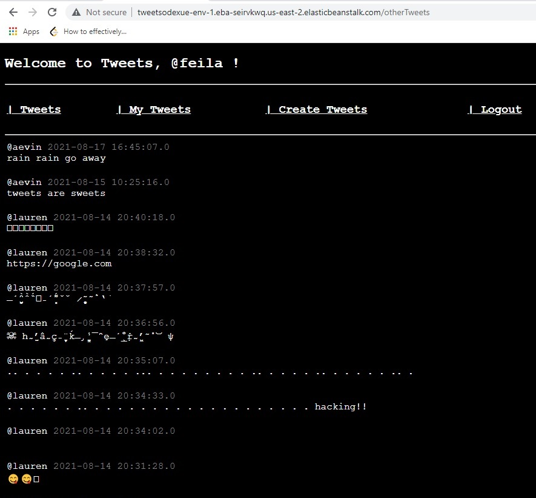
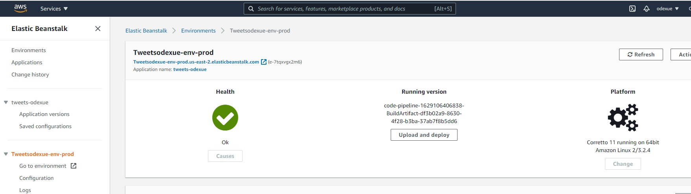
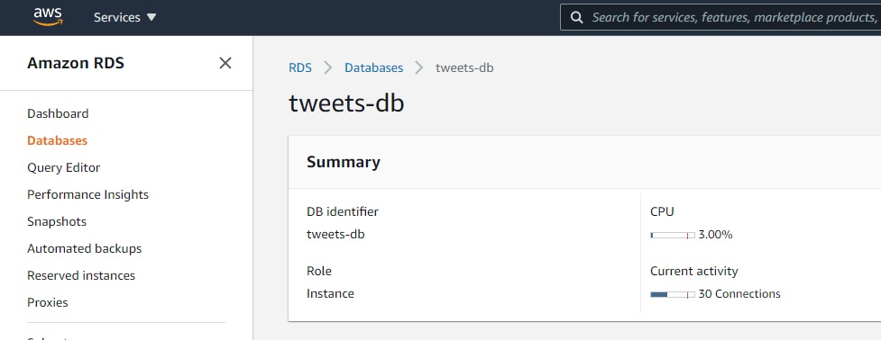
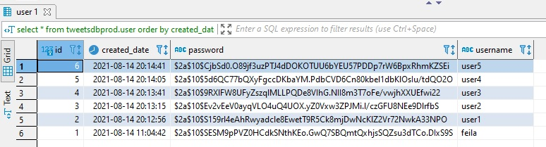
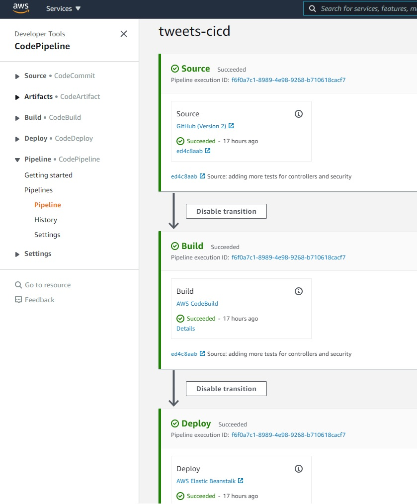
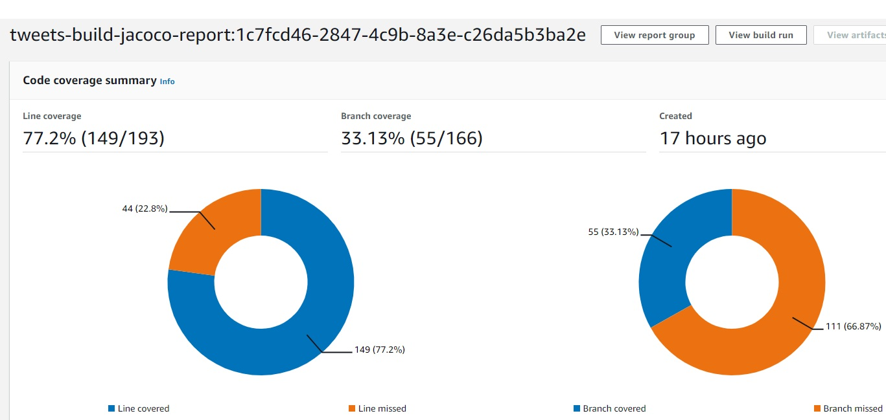
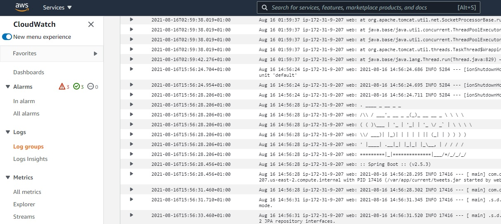

# tweets.

## tech stack.
Java 11 (could have used Java16 but Elastic Beanstalk does not support it yet)

Spring Boot 2

Gradle 7

Junit 5

Simple Spring Security for Login/logout

## application.
dev - http://tweetsodexue-env-1.eba-seirvkwq.us-east-2.elasticbeanstalk.com/tweets

qa - http://tweetsodexue-env-qa.us-east-2.elasticbeanstalk.com/tweets

prod - http://tweetsodexue-env-prod.us-east-2.elasticbeanstalk.com/tweets

## platform.
`AWS Elastic Beanstalk`

## database.
`AWS RDS - MySQL`
`Embedded H2 for integration testing and local development`

~ tweetsdb, tweetsdbqa, tweetsdbprod

~ for tweets storage, and used for simple identity store (user passwords are hashed)

## ci/cd pipeline.
`AWS CodePipeline`

~ push changes to main branch auto-triggers test, build, and deploy to AWS Elastic Beanstalk

~ code coverage jacoco report viewable on `AWS CodeBuild`

## logs.
`AWS CloudWatch`

